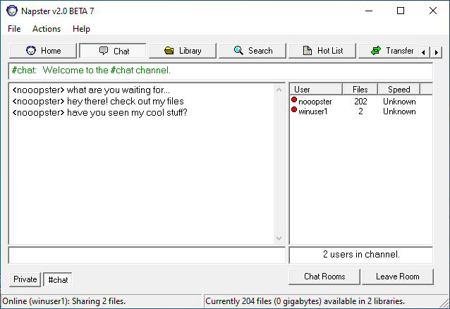
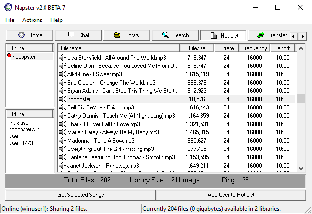

nooopster
=========
Players connect to a peer-to-peer file sharing network service
([Napster](https://en.wikipedia.org/wiki/Napster#Origin) via opennap) and
exploit a vulnerablity in a peer client to gain arbitrary file reads. A VPN is
employed to facilitate game infrastructure.

There are multiple clients that can be used to connect to the network, including
the original Napster 2.0b7 client. Players can discover the vulnerable client
by joining the #chat chatroom.

The vulnerable client shares their client binary, which players are expected to
reverse.

Once reversed, players should discover a path traversal vulnerability that
allows attackers to exfiltrate any file on the client system (/flag).
